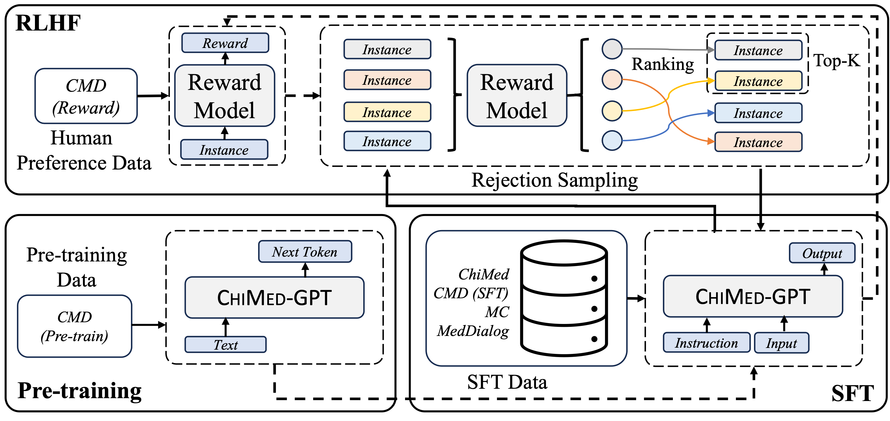

[**🇨🇳中文**](./README.md) | [**🌐English**](./README-EN.md)

# ChiMed-GPT

ChiMed-GPT 是一款基于 [Ziya-v2](https://arxiv.org/abs/2311.03301) 的中文医疗大型语言模型（LLM）。在Ziya-v2的基础上，综合进行了预训练、监督式微调（SFT）和来自人类反馈的强化学习（RLHF）。

更多关于该模型的信息即将发布。

## 引用

如果您使用或扩展我们的工作，请引用以下[论文](https://arxiv.org/abs/2311.06025)
```
@article{USTC-ChiMed-GPT,
  title="{ChiMed-GPT: A Chinese Medical Large Language Model with Full Training Regime and Better Alignment to Human Preferences}",
  author={Yuanhe Tian, Ruyi Gan, Yan Song, Jiaxing Zhang, Yongdong Zhang},
  journal={arXiv preprint arXiv:2311.06025},
  year={2023},
}
```

## 训练过程

ChiMed-GPT 的整体训练过程如下图所示。



## 结果

我们在信息提取、问答（QA）和多轮对话上评估了 ChiMed-GPT。

### 信息提取

在 CCKS2019 和 [ChiMST](https://github.com/synlp/ChiMST) 上的结果为

| 模型             | CCKS-2019 | ChiMST |
|-----------------|-----------|--------|
| GPT-3.5-Turbo   | 31.42     | 32.15  |
| GPT-4           | 41.37     | 41.25  |
| Ziya-v1         | 25.31     | 22.26  |
| Ziya-v2         | 27.84     | 25.76  |
| Baichuan        | 24.14     | 21.20  |
| Taiyi           | 30.90     | 30.55  |
| MedicalGPT (Z)  | 29.59     | 28.12  |
| MedicalGPT (B)  | 23.80     | 26.16  |
| CHiMed-GPT      | **40.82** | **41.04** |

### QA

在 [C-Eval](https://cevalbenchmark.com/)、CMMLU 和 MedQA 上的结果为

| 模型             | C-Eval | CMMLU | MedQA |
|----------------|--------|-------|-------|
| GPT-3.5-Turbo  | 56.58  | 49.91 | 44.50 |
| GPT-4          | 71.29  | 69.55 | 67.99 |
| Ziya-v1        | 36.59  | 29.07 | 12.50 |
| Ziya-v2        | 39.02  | 49.06 | 13.00 |
| Baichuan       | 41.46  | 45.28 | 13.00 |
| Taiyi          | 48.78  | 45.20 | 39.20 |
| MedicalGPT (Z) | 48.78  | 34.56 | 25.99 |
| MedicalGPT (B) | 39.02  | 43.82 | 18.50 |
| CHiMed-GPT     | **68.29** | **52.92** | **44.50** |

以及在 [ChiMed](https://github.com/synlp/ChiMST) 上的结果为

| 模型         | BLEU-1  | BLEU-2  | ROUGE-1  | ROUGE-2  | ROUGE-L  |
|----------------|------|------|------|------|------|
| GPT-3.5-Turbo  | 39.15| 32.85| 26.61| 7.31 | 16.84|
| GPT-4          | 33.61| 28.27| 26.51| 7.13 | 16.63|
| Ziya-v1        | 6.18 | 5.77 | 18.59| 3.94 | 12.66|
| Ziya-v2        | 38.41| 31.90| 26.91| 7.90 | 18.67|
| Baichuan       | 5.81 | 5.25 | 16.91| 3.01 | 11.30|
| Taiyi          | 11.73| 9.96 | 21.76| 5.26 | 15.46|
| MedicalGPT (Z) | 39.02| 32.35| 26.76| 8.10 | 18.16|
| MedicalGPT (B) | 5.82 | 5.26 | 16.61| 2.94 | 11.11|
| CHiMed-GPT     | **44.58**| **37.22**| **27.11**| **8.89** | **19.86**|

### 多轮对话

在 [MC](https://aclanthology.org/2020.coling-main.63/) 上的结果

| 模型             | B-1   | B-2   | R-1   | R-2  | R-L  |
|-----------------|-------|-------|-------|------|------|
| GPT-3.5-Turbo   | 24.29 | 20.17 | 20.64 | 8.39 | 17.14|
| GPT-4           | 18.58 | 15.76 | 18.92 | 6.62 | 14.55|
| Ziya-v1         | 15.85 | 11.75 | 9.92  | 3.04 | 9.02 |
| Ziya-v2         | 14.21 | 10.99 | 12.20 | 4.45 | 10.61|
| Baichuan        | 3.44  | 1.61  | 3.87  | 0.34 | 3.49 |
| Taiyi           | 5.81  | 4.67  | 14.23 | 4.55 | 11.99|
| MedicalGPT (Z)  | 20.26 | 16.42 | 17.51 | 5.42 | 14.21|
| MedicalGPT (B)  | 3.94  | 2.19  | 4.34  | 0.13 | 3.50 |
| CHiMed-GPT      | **33.14** | **30.86** | **43.43** | **34.91**| **42.16**|

## 下载

1.0 版本已在 [Hugging Face](https://huggingface.co/SYNLP/ChiMed-GPT-1.0) 发布。

## 使用方法
```python
from transformers import AutoTokenizer
from transformers import LlamaForCausalLM
import torch

query="[human]:感冒怎么处理？\n[bot]:"
model = LlamaForCausalLM.from_pretrained('SYNLP/ChiMed-GPT-1.0', torch_dtype=torch.float16, device_map="auto").eval()
tokenizer = AutoTokenizer.from_pretrained(ckpt)
input_ids = tokenizer(query, return_tensors="pt").input_ids.to('cuda:0')
generate_ids = model.generate(
            input_ids,
            max_new_tokens=512, 
            do_sample = True, 
            top_p = 0.9)
output = tokenizer.batch_decode(generate_ids)[0]
print(output)
```

## 免责声明

请注意，ChiMed-GPT 生成的内容，包括任何建议、建议、信息或推荐，不反映我们的观点或信仰。大型语言模型提供的响应不应被视为我们的认可、意见或建议。我们不对提供的信息的准确性、可靠性或适当性负责。用户在解释和使用大型语言模型生成的信息时，应行使自己的判断和谨慎。


